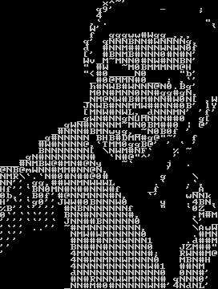

# rusty_mosaic

rusty_mosaic is a Python library designed for creating photomosaics. It leverages Rust extensions to speed up sum of squares calculations, ensuring efficient performance even with large images.

## Installation

You can install the requirements using Poetry

```sh
poetry install
```

This library also uses rust extensions to speed up tile comparisons. In order to build these extensions you can use the following commands

```sh

# install the package in editable mode
maturin develop --release

# or build and install the wheel
maturin build --release
pip install ./target/wheels/rusty_mosaic-<version>-<platform>.whl
```

### CLI Usage

The library exposes a cli utility called "mosaicfy".

```sh
mosaicfy --help

 Usage: mosaicfy [OPTIONS] INFILE

╭─ Arguments ─────────────────────────────────────────────────────────────────────────────────╮
│ *    infile      PATH  [default: None] [required]                                           │
╰─────────────────────────────────────────────────────────────────────────────────────────────╯
╭─ Options ───────────────────────────────────────────────────────────────────────────────────╮
│ --scale                              FLOAT    [default: 1.0]                                │
│ --tile-size                          INTEGER  [default: 8]                                  │
│ --text                  --no-text             [default: no-text]                            │
│ --show                  --no-show             [default: no-show]                            │
│ --outfile                            PATH     [default: None]                               │
│ --install-completion                          Install completion for the current shell.     │
│ --show-completion                             Show completion for the current shell, to     │
│                                               copy it or customize the installation.        │
│ --help                                        Show this message and exit.                   │
╰─────────────────────────────────────────────────────────────────────────────────────────────╯
```

For example to create a mosaic of the image ./examples/poe.png and save it to a file you would call

```sh
mosaicfy ./examples/poe.png --outfile examples/poe-mosaic.png
```

Which produces the result



Alternatively you can print out a text version of the mosaic like

````text
mosaicfy ./examples/poe.png --text --show
               x^~'
              q9'       -     ;
              4
             ,`.               ",
             W'                 `
             f  gggww#Wgg_,,,
            q' qNNNBNN#WNNNNg,
            d  #NNM##NNNWNWN0f
            [' #BNMB#NNN0#N#N'
            Wv_M~MNN0#NW#NNBN'
            " #W  ~M0BMMMNM@H
            "<#0____N0     "b'
             _#0@MMN#0__ ; ,`'
             h#NWB#WNNN@N0.Bg'
             M0N#MNN0NN#gg#gN,
            _NM@NW#B#M#NN#W0N[ ,W
            JNWB#NNMMW##NN#0B' lY
            [MNW#NWL,_dNNNMN' 'f'
           _gWN#NNgNUMNNN##0  g[
        _gWN#NNNNM~MN0BM##0 | @'
       _#NNN#BMNwyg,_~N0B0f '
     _g#NNNNN BHB#DMM#g@"~'  f
     #W#NNNN@,`TMM0ggB@' ' ` '
     BNNNNNNN[ \NWM#NF`   % ~
  _gN#NNNNNNN#  `N#@"^'   '
___#NMBW@#MN#@Ny   ~`     j  .
@NB@mWNN#MM#NN@N,         '
NMR\`.`N#0#N##@0#        g    \
NN''.gg,##WNMNWWWL      .`   .`,
Hf''`BN0MN#N##NNW#f    _f    '_A
0b,'.B0f'#@NNMNNN#N,   `'    wNNk
H'`'`g0''JWW#0BNNNW0     y   .4BN,
%B''`'''' #NBNNNNNNNf    "   `0Z_`
0`'```''' BNN#NNNNNN#,        ,M#M
''''``''` JNN##BNNNNN0        \' _
'`'' ..'' ~#NMNNNNNNNN,       \AwW
'`''       NMW#WMNNNNN0       .#MN
'''        #N###NNNWNNN1     .d##M
''         BN##N#NNNNNN0    JZM##"
'          4MNNNNNNNNNN#;   RWN#M@
          4N#WNMNNWMNNN0   MBN#H
          4NNNNMNNNNNNW#1  ##NM
          dNNNNNNNNNNNNN0  0NN#'
          #N#RNNNWWMNNNN# qNNN0'
         _NN#M#0#NNNNNWN#'4NdNL'
````